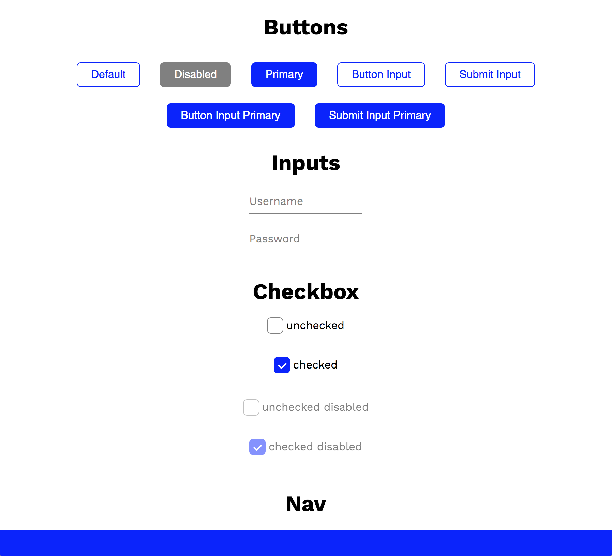

# Foolish CSS BETA

Inspired by [Bare.css](http://barecss.com/)

A simple very lightweight css framework with no classes. Instead you just use raw html elements like `<button>`, `<input>`, `<h1>`, `<p>`, etc. This is meant for very lightweight purposes to just get some basic styling of common used html elements. If you want something with more bells and whistles then use something like bootstrap.

## Demo

You can find the demo here:

https://joeyjiron06.github.io/foolish-css/

Screenshot



## Usage

```html
<link
  rel="stylesheet"
  href="https://unpkg.com/foolish-css@latest/default-theme.css"
/>
<link
  rel="stylesheet"
  href="https://unpkg.com/foolish-css@latest/index.min.css"
/>
```

## Custom Theme

Look at [default-theme.css](./default-theme.css) for all values that you must provide.

```html
<style>
  :root {
    --color-primary: blue;
    --color-grey: grey;
    --color-white: white;
    --color-black: black;

    --padding-1: 4px;
    --padding-2: 6px;
    --padding-3: 8px;
    --padding-4: 12px;
    --padding-5: 16px;
    --padding-5: 20px;

    --margin-1: 4px;
    --margin-2: 6px;
    --margin-3: 8px;
    --margin-4: 12px;
    --margin-5: 16px;
    --margin-5: 20px;

    --border-radius: 6px;
  }
</style>

<link
  rel="stylesheet"
  href="https://unpkg.com/foolish-css@latest/index.min.css"
/>
```

## Publishing

```bash
npm version YOUR_VERSION_HERE
git push origin master --follow-tags
npm run deploy
```
